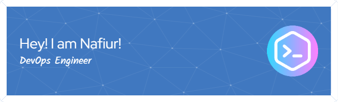

- 👀 I’m interested in System Design
- 🌱 I’m currently learning CI/CD
- 💞️ I’m looking to collaborate on Datacentic projects and Prototyping

## 📝 Blogs and writing
I've very active, writing content regularly to at least one of these.
- [Technical Blogs](https://nafiurrashid.medium.com/)
- [Non-Tech Blogs](https://nafiurrashid.wordpress.com)

## 📫 How to reach me

 

## 🎓 Education
- Ahsanullah Universdity of Science and Technology, BSc in CSE, 2019
- Govt Science College, HSC, 2013
- Ideal School and College, SSC, 2011 

## 💻 Work Experience
- Line Reflection, DevOps Engineer, Mar 2022-July 2022 
   - Deployed projects according to clients' need using Terraform, Jenkins, Docker, Git etc. 
   - Develop Strategis, process, and tools to ensure manageable and efficient deployments. 
   - Plan and Execute updates, and migrations in Dev, Stage, and Prod for different codebases eg: React, Django, Wordpress etc. 
- Probashi Sheba, Software Engineer, Jan 2021-Feb 2022 
   - Deployed and maintained 15+ codebases and their respective servers. 
   - Review client requirement and make Project Requirement Document, Information Architecture, User Flow Etc 
   - Orchestrate design sprint which results in two mobile app prototype with 300+ pages each. 
   - Collaborate with frontend designers and UI designers to translate client requirements into feature  

## 📚 Training and Certifications
- Server Administration and Cloud Management, BITM 
- DevOps With GCP, Poridhi.io 
- Intermediate Python, Datacamp 
- Nitty gritty of python, Dev Skill 
- SQL for Data-Science, Couresera
 

## 💻 Github Repositories
 - Rental Inventory : https://github.com/nafiurrashid/react_project
 - Problem Solving : https://github.com/nafiurrashid/Problem-solving 
 - Sentiment Analysis in Market Prediction A Comparative Study between Traditional and Transfer Learning: https://github.com/nafiurrashid/Sentiment-Analysis-in-Market-Prediction-A-Comparative-Study-between-Traditional-and-Transfer-Learni

# 💻 Tech Stack:

     
 
 
     
<!-- 
 -->
# 📊 GitHub Stats:
 
<!--   -->

<!-- 
 -->
## 🏆 GitHub Trophies 
  

---

